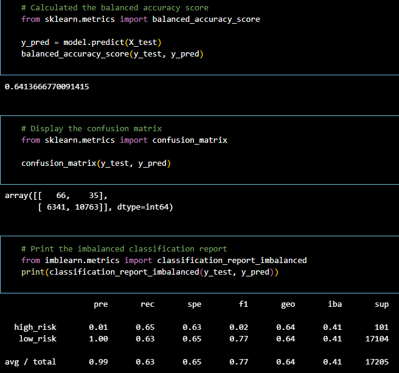
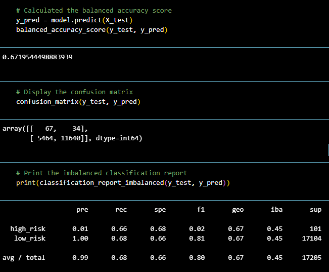
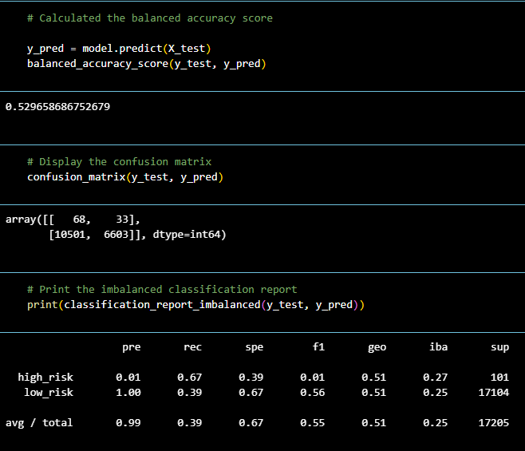
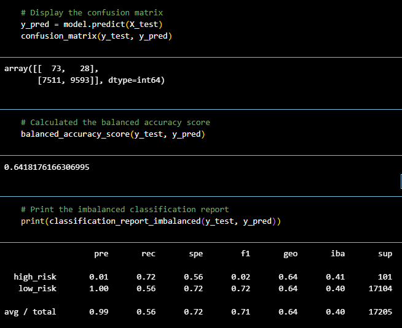
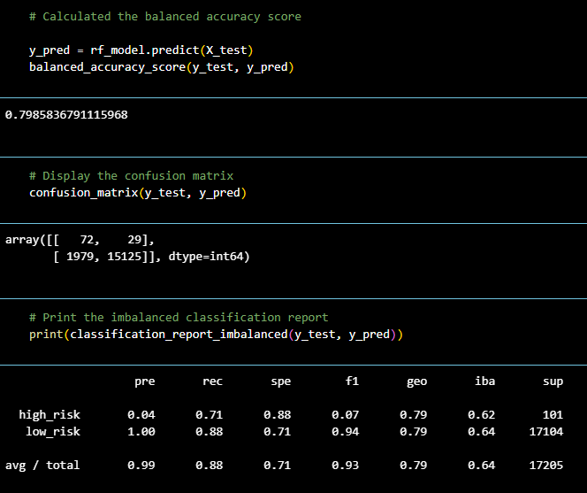
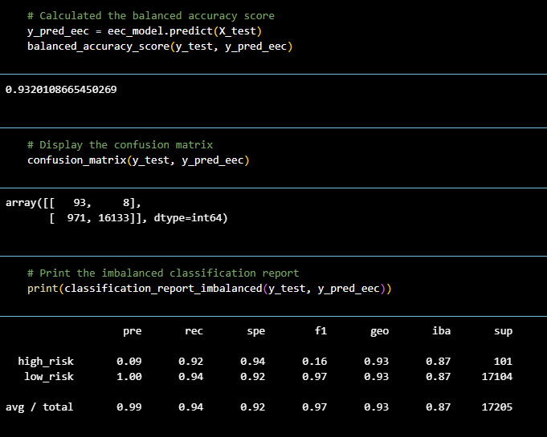

# Credit_Risk_Analysis

## Overview

Credit risk is an inherently unbalanced classification problem, as good loans easily outnumber risky loans. Due to this situation, I will employee different techniques and evaluate those models. I will use libraries from imblearn and scikitlearn to evaluate risk. Using credit card data from LendingClub, I will resample the data and determine the accuracy of each model.

## Results

First, the data needed to be cleaned and transformed in order for the machine learning resampling to function. Converting the string values into numerical ones was the method. Once I checked the balance of the target variation the imbalance was eggregiously one sided: 'low_risk': 51366, 'high_risk': 246.

### Naive Random Oversampling

* The data was oversampled to match the low risk target to 51366.
* The accuracy score was 64.1% showing us that this model will not be the most reliable. 
* The precision for high risk is extremely low at .01 which makes sense when there were only 66 True Positives.
* Sensitivity is low  for both risk levels ranging between .63-.65 

### SMOTE Oversampling

* Again, the data was oversampled to match the low risk target of 51366.
* The accuracy was slightly better at 67.2%, but still seems unreliable.
* The precision for high risk doesnt change and remains at .01. It appears there was only one more True Positive than Naive Oversampling.
* Sensitivity also had a slight improvement for both risks ranging from .66-.68. 

### Cluster Centroid Undersampling

Oversampling obviously didn't give us the results we were looking for, so taking a different approach might help. Instead of oversampling, we will attempt undersampling model.

* This time instead of matching the low risk target, I aimed to match the high risk number of 246.
* Using a cluster undersampling technique reduced the accuracy of our model to 53%
* Changing methods did nothing to improve the high risk precision as it still remains at .01
* There was a much greater separation in sensitivity with undersampling as the range fell to .39-.67. Reducing the number of low risk targets greatly hurt their sensitivity score.

### Combination (Over and Under) Sampling

* Over/Under sampling actually changed the high risk and low risk number separately to high_risk: 68458, low_risk: 62022
* This model was able to bring accuracy back up to 64.2%, but we are still getting unreliable score.
* Precision for high risk remains extremely low at .01
* Sensitivity range improved a little to .56-.72

### Balanced Random Forest Classifier

* Accuracy finally sees a good accuracy score of 79.9%
* Using ensemble learning has improved precision to .04 for high risk.
* Sensitivity has received a higher range of .71-.88 respectively. 

### Easy Ensemble AdaBoost Classifier

Also known as Easy Ensemble Classification, this model and the random forest clasifier uses decision tree based technique. 

* The balanced Accuracy Score reaches 93.2% with this model. 
* Precision for high risk has improved to .09 but still remains low.
* Sensitivity reaches the top 90th percentile with a range of .92-.94

## Summary

Comparing the above six methods, my best recommendation would be to go with the Easy Ensemble AdaBoost Classifier model. 

* The decision tree model gave us the highest accuracy of 93.2%
* While the precision for high risk is still low at .09, it has improved when compared to all other 5 models.
* The sensitivity with the EEC model gave us the highest numbers at .94 low risk, and .92 high risk. This means that only  971 cases were detected as high risk out of 17104. 

